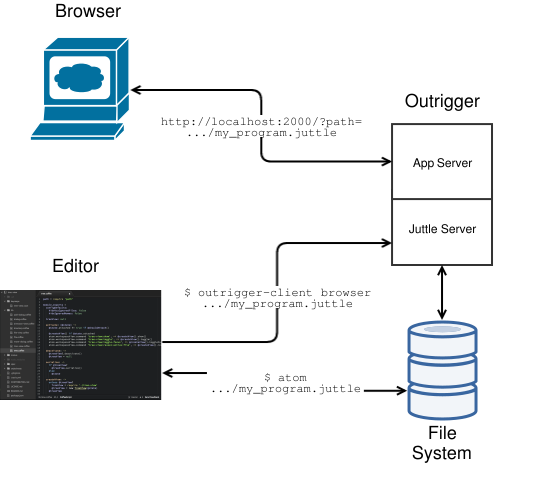

# Architecture

## Components

Use of outrigger involves an editor, the outrigger daemon, the outrigger client program, and a web browser. The editor and daemon share a file system that contains one or more juttle programs. The browser connects to the daemon to view the output of a juttle program, change input controls, and re-run programs.

Here's how the editor, daemon, client, and browser work together to develop, run and view that program.

### Editor

Edit juttle programs in your favorite editor. There are modes for [emacs](https://github.com/juttle/juttle/tree/master/misc/emacs) and [vim](https://github.com/juttle/juttle/tree/master/misc/vim) that provide syntax highlighting and/or compile commands that may be useful.

### Outrigger Daemon

Outrigger is responsible for running and managing juttle programs. It provides an [API](./jobs-api.md) to bundle programs (i.e. load programs and associated modules), run programs, and stream the results of programs to browsers over a [websocket protocol](./jsdp-api.md).

Outriggerd also serves a web application that allows you to view the output of juttle programs and re-run the program with different input control values.

### Outrigger Client

The client program provides command-line access to outrigger's APIs. For example, to run a program:

``bin/outrigger-client browser --path home/bob/juttles/my_program.juttle``

This will instruct the daemon to pick up the program and will open a browser tab/instance that connects to the web app served by the daemon. In this case, the web app's url is ``http://localhost:2000/?path=/home/bob/juttles/my_program.juttle``.

You can also use the client program to access the other endpoints of the API and websocket protocol.

### Browser

Using the browser, you can view the program's outputs, change input control values for the program, and re-run the program.

Every time you reload the web app, outriggerd reloads the juttle program from disk, picking up any new changes made by the editor.

## Relation to other juttle packages

Outrigger brings together several standalone juttle packages into a single development environment:
* It depends on the [Juttle](https://github.com/juttle/juttle) package, which provides the juttle compiler and runtime.
* It depends on the [Juttle-viz](https://github.com/juttle/juttle-viz) package, which provides the reference set of client view sinks.
* It can utilize Juttle adapters for various backends including [Elastic Search](https://github.com/juttle/juttle-elastic-adapter), [MySQL](https://github.com/juttle/juttle-mysql-backend), [Twitter](https://github.com/juttle/twitter-backend), [Gmail](https://github.com/juttle/gmail-backend), etc.
